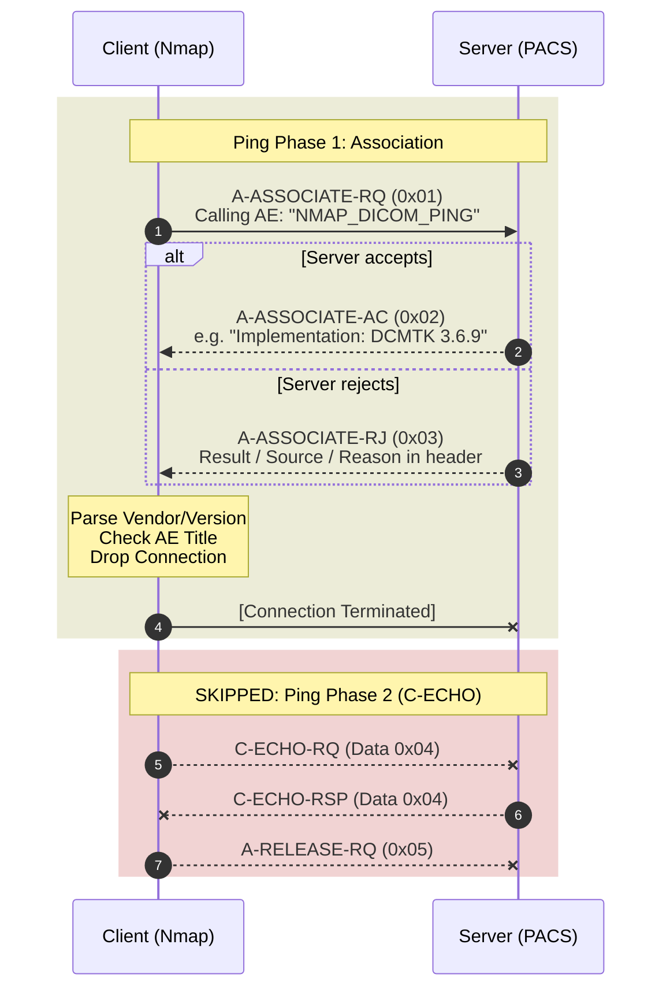

The A-ASSOCIATE-AC packet (the accept response in DICOM's session-setup handshake) leaks vendor, version, and accepted capabilities. Nmap doesn't parse them. The NSE (Nmap Scripting Engine) library has shipped DICOM scripts since 2019 and they leave bytes on the table.

This is network protocol only. DICOM file security stuff is in the [102]().

## The Wire: Ports, Services, and Auth

Classic DICOM listens on 104 and 11112; DICOM-over-TLS on 2762; DICOMweb (WADO/QIDO/STOW) rides 80/443. DICOM nodes act as Service Class Users (SCUs) and Service Class Providers (SCPs): client and server, basically. The same physical box often plays both roles in different sessions. A CT is an SCU when it pushes a study and an SCP when a viewer queries it.

Two of them set up an A-ASSOCIATE before any DIMSE (DICOM Message Service Element) message moves. A-ASSOCIATE is a TCP-level handshake that negotiates which operations the session will allow. Everything in this post happens in or right after that handshake.

DICOMweb rides HTTPS, so on paper auth is in a better place: bearer tokens, OAuth, standard TLS, all the REST-API hygiene the upper-layer protocol never had. In practice, deployments ship with no auth or vendor default credentials, and the attack surface collapses into "under-configured REST API with PHI behind it." DICOMweb is out of scope for this post; the lack of Nmap coverage is in the gaps list at the end.

### DIMSE Services

After association, DIMSE splits into two families. **C-services** (Composite) act on clinical objects themselves: store, find, get, move. This is the data plane, where PHI lives and where nearly all pentest and threat-model attention goes. **N-services** (Normalized) are workflow-state verbs that move a procedure between lifecycle states like IN PROGRESS and COMPLETED, e.g. MPPS (Modality Performed Procedure Step), storage-commitment results, print jobs.

N-services get far less scrutiny. Once a peer is associated there's no per-verb auth, so an `N-SET` that flips an MPPS to COMPLETED or a forged storage-commitment `N-EVENT-REPORT` lands with the same trust as a `C-STORE`. No pixels touched, no hash mismatch, just corrupted workflow. The ones you need to know:

| Service | Why a pentester cares |
| --- | --- |
| `C-ECHO` | Protocol ping. Sent over an established A-ASSOCIATE. |
| `C-STORE` | Upload DICOM objects to the peer. Entry point for file-format fuzzing. DICOMweb's `STOW-RS` is the modern equivalent ingress, inheriting the REST-API failure modes from above. |
| `C-FIND` | Query: patient lists, studies, series, Modality Worklist. PHI exposure or authorization-scoping check. |
| `C-MOVE` | Client names a destination AE Title (Application Entity Title); server opens a new A-ASSOCIATE there and C-STOREs the objects to it. SSRF-adjacent pivot primitive. |
| `C-GET` | Server returns objects over the current association: no second outbound connection, so not a pivot. Try when `C-MOVE` is blocked. |
| **N-services** (`N-CREATE`, `N-SET`, `N-ACTION`, `N-EVENT-REPORT`, `N-GET`) | Workflow/event verbs: MPPS state, Storage Commitment receipts, Print. No pixel data, so audit rules and threat models routinely skip them. |

## Auth in DICOM

An AE Title is a plain string in a packet header. Trend Micro's late-2025 scan of 3,627 internet-exposed DICOM servers found 99.56% accept `ANY-SCP` (the wildcard AET meaning "any caller") as a valid peer [[5]](#references). The auth model's defaults are the deployed defaults.

Classic DICOM ties no identity to that string. A-ASSOCIATE layers two authorization controls on top of it, neither of which proves who you are: the server decides whether the peer can connect, and what operations the association can use. When the server accepts `ANY-SCP`, both controls collapse into the second.

| Control | What it authorizes | Granularity | Typical failure |
| --- | --- | --- | --- |
| Called AE Title | Whether you can ask — is the association accepted at all | Per-AET (one device may register several) | ANY-SCP wildcard accepts any caller |
| Abstract Syntax / SOP Class UID | *What you can ask*: which operation classes the association can use (Storage, Query/Retrieve, Modality Worklist, MPPS, Print) | Per-operation-class | Storage accepted when the role only needs Query |

C-MOVE turns the AET-vs-identity gap into a primitive. The destination AE Title in a C-MOVE-RQ is a name the server looks up in its own table (AET to IP:port), then opens a new outbound connection to wherever that entry points. Name an AE Title the PACS (Picture Archiving and Communication System) already trusts and it will ship PHI to wherever that entry maps.

The C-MOVE pivot assumes the attacker is knowledgeable about other DICOM systems in the environment. But Greenbone's 2019 audit found a single PACS holding 1.23 million studies with SSNs records and an archive of US Army hospital data with patient identifiers. No exploit needed, just a DICOM viewer pointed at a public IP address [[6]](#references). TridentUSA passed an HHS Security Rule audit in March 2019 while its 187 servers sat indexable on Shodan.

One physical device typically registers several AETs (Storage, Storage Commitment, Modality Worklist, Print), each scoped separately in the PACS config. Naming conventions like `MR_ER_3` or `WORKLIST_PROD` are predictable enough that wordlists work, which is why `dicom-brute` exists.

One IP, many AETs. A 2004 AAPM physics report walking through DICOM connectivity at a real site notes a single CT advertising one AET as a Storage SCU and a different AET (`PR-ct5_SCU`) as a Print SCU [[4]](#references). That's the rule. So an AET wordlist hit isn't telling you the device's name; it's telling you one of the device's roles. Run `dicom-enum` against each hit and the capability map will differ per AET.

For network authentication, DICOM supports two mechanisms:

- **DICOM TLS**: authenticates the transport peer. Mutual-auth capable.
- **User Identity Negotiation**: authenticates the user. [DICOM PS3.7 §D.3.3.7](https://dicom.nema.org/medical/dicom/current/output/html/part07.html) defines a User Identity sub-item (Type `0x58`) that rides inside the A-ASSOCIATE-RQ and supports one of:
    - username only
    - username + passcode
    - Kerberos service ticket
    - SAML assertion
    - JSON Web Token (JWT)

### User Identity Negotiation

The catch: **a credential rejection isn't distinguishable by Reason code.** [PS3.7 §D.3.3.7.3](https://dicom.nema.org/medical/dicom/current/output/chtml/part07/sect_D.3.3.7.3.html) puts the signal in the Source byte alone — Source=`2` (service-provider) for a credential miss, Source=`1` (service-user) for an AE Title miss — and reuses Reason=`1` "no-reason-given" for both. There is no distinct Reason value for credential failure, which is why every stack flattens the two cases differently in practice. The pentester-side decode is in [What the Reject Tells You](#what-the-reject-tells-you) below.

None of this is authentication. It's a guest list with no bouncer. When a forged storage-commitment `N-EVENT-REPORT` lands at 3 a.m., the on-call biomed sees a workflow-state anomaly on a Tuesday morning ticket, not an authentication failure: the protocol never thought to call it one.

### TLS: Specified, Inconsistently Deployed

[PS3.15](https://dicom.nema.org/medical/dicom/current/output/html/part15.html) defines TLS profiles with mutual auth. The spec is fine. The deployments are not.

There's no STARTTLS-style upgrade in A-ASSOCIATE and no in-band signal that a peer requires TLS. A listener on 104 either speaks DICOM in the clear or it speaks TLS, and you find out by probing. Port 2762 is `dicom-tls` per IANA, but plenty of deployments run TLS on 104 or 11112 because the vendor's config UI has one "DICOM port" field and a "use TLS" checkbox.

So integrators bolt encryption on at layers they understand. Four patterns, only the last is actual DICOM TLS:

1. **DICOMweb behind an API gateway** (hospital ↔ cloud). Google Cloud Healthcare, AWS HealthImaging, Azure DICOM Service, modern teleradiology SaaS: DICOM verbs over HTTPS with OAuth at the edge.
2. **Site-to-site VPN with plain DIMSE inside** (hospital ↔ teleradiology). The "TLS" is the VPN; the inner DIMSE hop is plaintext.
3. **Image exchange networks** (hospital ↔ hospital, via vendor). Nuance PowerShare, Life Image, Intelerad/Ambra: managed DICOMweb gateways with a sales team.
4. **DICOM TLS on 2762 or TLS-wrapped 11112** (modality ↔ PACS; intra-hospital). Rare, and almost always inside a single health system rather than between organizations.

Whatever the envelope, the inner DIMSE rides the same Called AE Title gate from §Auth. The transport authenticated; the verbs still trust whatever AET the peer claims. More commonly it's server-auth only, with the AE Title standing in as "client identity," which is not authentication.

When mutual TLS does show up, it usually rides a flat hospital-wide CA. Every modality's cert is trusted to act as every other and the hospital IT engineer who stood the CA up years ago has retired. Revocation is never configured. The CA is a participation trophy, and the MDM ships with self-signed defaults because their procurement process doesn't make them ship anything else.

## What Nmap Already Does for DICOM

With the auth model in hand, here's what Nmap already ships to probe it. Two DICOM-aware NSE scripts, both Paulino Calderon's 2019 work [[1]](#references): `dicom-ping` (discovery) and `dicom-brute` (AE Title brute-force), riding the `dicom` NSE library he also wrote. My PRs build on that surface: fingerprinting reads bytes that already come back in the AC, and capability enumeration proposes a richer Presentation Context list to map what the SCP will accept. The `dicom-ping` loose ends are a separate diff.

### 1. Port Scanning

```bash
nmap -sS -p 104 <target>
```

Without any NSE scripts, you can tell if DICOM-related ports are open. Port 104 is the standard DICOM port. But let's be honest, knowing a port is open tells you almost nothing. Could be DICOM. Could be an SSH daemon someone bound to 104 by mistake. It's like confirming a building has a door. Congratulations.

### 2. DICOM Discovery (dicom-ping)

```bash
nmap -sC -p 104 <target>
```

With Nmap's default scripts enabled (`-sC`), the `dicom-ping` script runs automatically. `-A` will also pull it in, but `-A` is `-sC` plus OS detection, version detection, and traceroute, which could be more than you want to throw at a hospital network. For DICOM recon specifically, starting at the targeted `-sC -p 104` is best.

A typical run looks like this:

```
PORT     STATE SERVICE REASON
4242/tcp open  dicom   syn-ack
| dicom-ping:
|   dicom: DICOM Service Provider discovered!
|_  config: Called AET check enabled
```

A successful association (AE accepted) or even a rejected (A-ASSOCIATE-RJ) one is enough for Nmap to report. So the script sees the server speak DICOM and calls it a day.

#### How This Works

Since everything Nmap does for DICOM (discovery, "insecure AE Title" detection, brute force, and the vendor/version fingerprinting I'll get to below) rides on this same A-ASSOCIATE exchange, it's worth pausing on the actual wire flow before going further.



Nmap sends an A-ASSOCIATE-RQ, the server responds with an A-ASSOCIATE-AC (accept) or A-ASSOCIATE-RJ (reject), and Nmap drops the connection. Nmap DICOM scripts are built on parsing whatever comes back in that single response: no extra packets, no extra noise on the network. Keep this mental model.

One script-specific note: `dicom-ping` flags `ANY-SCP` accept as insecure. Given the §Auth population stat, the flag fires on most internet-exposed targets — it's the default condition, not the outlier.

### 3. AE Title Brute Force

```bash
nmap --script dicom-brute <target>
# With a custom wordlist:
nmap --script dicom-brute --script-args dicom-brute.aets=aets.txt <target>
```

`dicom-brute` is categorized under `auth` and `brute`, not `default`, so `-sC` won't pull it in. You have to call it explicitly. The most important script argument here is `dicom-brute.aets`, which lets you specify a wordlist for guessing the called AE Title.

If `dicom-ping` came back rejected, or came back accepted under `ANY-SCP` and you want to enumerate real AETs, this is your next move. Feed it a list of common AE Titles and see what sticks.

#### What the Reject Tells You

When the server sends A-ASSOCIATE-RJ instead of AC, [PS3.8 §9.3.4](https://dicom.nema.org/medical/dicom/current/output/html/part08.html) defines the `(Result, Source, Reason)` triple in the reject PDU (Protocol Data Unit). Decode it:

| Result / Source / Reason | What likely happened | Pentester move |
| --- | --- | --- |
| 1 / 1 / 1 (rejected permanent, service-user, no reason given) | AE Title miss. On stacks that flatten credential rejections into this code (rather than the spec-compliant `1/2/1`), it can also mean a credential miss. **Without** a `0x58` sub-item in your RQ, assume AE Title; **with** a `0x58`, could be either. | Try an AE Title wordlist first; once you've pinned a valid AET, re-run *with* a `0x58` and pivot to a credential wordlist. |
| 1 / 1 / 7 (called AET not recognized) | AE Title gate, explicit | Brute AE Title |
| 1 / 2 / 1 (rejected permanent, service-provider, no reason given) | Spec-compliant credential miss. AE Title accepted, user identity rejected. | Keep the AET, brute `0x58` credential forms. |

Order of operations: on spec-compliant stacks the Source byte alone separates the two gates (`1/1/*` = AE Title, `1/2/*` = user identity), so you can run the campaigns independently. On stacks that flatten everything to `1/1/1`, the code means different things depending on whether your RQ carried a `0x58`. (`1/1/2 protocol version not supported` also exists, rare in practice; flip the Protocol-Version bits and re-propose if you hit it.)

The AC tells you who built the stack, the RJ tells you which gate you tripped on. Once you're past both gates, `dicom-enum` tells you what the stack will actually speak.

## Adding Vendor & Version Fingerprinting

I submitted a PR to Nmap to add basic DICOM vendor and version detection [[2]](#references). Seems boring on the surface, but it's core to what Nmap does: fingerprinting. Default tooling should ship with first-class identification of what stack you're talking to. Nmap's didn't, so I wrote it.

Who knows when the PR gets merged, so I'm writing about it now.

### What dicom-ping Leaves on the Table

After looking at the DICOM A-ASSOCIATE packets that Nmap's `dicom-ping` script already exchanges, I noticed something useful: the A-ASSOCIATE-AC (accept) response contains reliable vendor and version information just sitting there. No extra packets.



The A-ASSOCIATE-AC packet has a User Information payload (Item Type `0x50`) containing nested Type-Length-Value (TLV) structures. The two fields the PR fingerprints:

- **`0x52` Implementation Class UID**: a dot-notation OID (Object Identifier), mandatory in the AC. The DICOM spec says UIDs "shall not be parsed", but in practice the root arc identifies the implementer: [`1.2.276.0.7230010.3`](https://oid-base.com/get/1.2.276.0.7230010.3) is OFFIS DCMTK (a software library); [`1.2.840.113619`](https://oid-base.com/get/1.2.840.113619) is GE Medical Systems (an OEM).
- **`0x55` Implementation Version Name**: a free-form string, optional. `OFFIS_DCMTK_369` parses to DCMTK 3.6.9 [[3]](#references). Conforming implementations can omit it, and the PR handles that case.

#### Why You Need to Look Up Both

In theory `0x52` is the authoritative vendor identifier, the medical device manufacturer (MDM) implementing the DICOM stack. In practice, a lot of lazy MDMs ship devices with a third-party stack's UID (DCMTK, dcm4che, pynetdicom) and never override it. So `0x52` would happily report "OFFIS" on a device that's actually a Brand X modality with DCMTK linked in. You can't trust either field in isolation.

From a pentester's point of view, `0x55` is probably the most important. The Version Name tends to track the software that's actually on the wire, parsing PDUs. That's the majority of the attack surface: which library's bugs you get, regardless of whose product.

The PR does pattern-match table lookups on **both** fields independently. The 0x52 path runs the UID against two OID tables, one for software toolkits and one for device manufacturers, so the result tags which side it came from:

```lua
local TOOLKIT_UID_PATTERNS = {
  {"^1%.3%.6%.1%.4%.1%.25403%.",                  "ClearCanvas"},
  {"^1%.2%.826%.0%.1%.3680043%.9%.3811%.",        "pynetdicom"},
  {"^1%.2%.826%.0%.1%.3680043%.8%.641%.",         "Orthanc"},
  {"^1%.2%.826%.0%.1%.3680043%.8%.1057%.",        "OsiriX/Horos"},
  {"^1%.2%.276%.0%.7230010%.3%.",                 "DCMTK"},
  {"^1%.2%.40%.0%.13%.1%.3",                      "dcm4che"},
}

local MANUFACTURER_UID_PATTERNS = {
  {"^1%.2%.840%.113619%.",                        "GE Healthcare"},
  {"^1%.3%.12%.2%.1107%.",                        "Siemens"},
  {"^1%.2%.840%.113704%.",                        "Philips"},
  {"^1%.3%.46%.670589%.",                         "Philips"},
  {"^1%.2%.840%.114257%.",                        "Agfa"},
  {"^1%.2%.392%.200036%.",                        "Fujifilm"},
}
```

The 0x55 path uses a similar table keyed on substrings of the version string. Surfacing what each field says lets you compare:

- If `0x52` and `0x55` disagree, that's a useful signal: an OEM customized the stack, and you should look up the OID to find who.
- If both fields point at the same open-source stack, the manufacturer probably never registered their own OID.

And the second case isn't a corner. Trend Micro's 2025 scan of 3,627 internet-exposed DICOM servers fingerprinted 44% as DCMTK and 14% as OsiriX; 321 of the OsiriX servers, or 9% of the entire exposed population, was still running version 3.6.1, a 2009 release [[5]](#references). The `TOOLKIT_UID_PATTERNS` table above resolves to almost half of the exposed population on its own. Another 32% returned a UID neither table matches. This is a collection of some OEMs that registered their own arc and never published it to public OID databases, some are OEMs who invented a string and called it a UID, and some omitted `0x55` entirely so there was nothing to match against. The spec says UIDs "shall not be parsed." So the vendor took that as license to make them unparseable.

## Capability Enumeration (dicom-enum)

Knowing the box is Orthanc 1.11.0 isn't enough. The next questions: what role does it play — archive, work-order server, scanner, print gateway — and which objects will it accept? Both answers sit in the A-ASSOCIATE-AC if you propose enough Presentation Contexts to draw them out. So I wrote [`dicom-enum`](https://github.com/tmart234/nmap_dicom/blob/main/scripts/dicom-enum.nse), a third NSE script that proposes about thirty contexts in one A-ASSOCIATE-RQ and buckets the responses.

Per [PS3.8 §9.3.3.2](https://dicom.nema.org/medical/dicom/current/output/html/part08.html), the AC returns one of five result codes per Presentation Context: accepted, user-rejection, abstract-syntax-not-supported, transfer-syntaxes-not-supported, no-reason. What lands in `accepted` is what the server will process on the next DIMSE op.

```
| dicom-enum:
|   association: accepted (max_pdu=16384, vendor=Orthanc 1.11.0)
|   service_classes:
|     QR-Patient-Root
|     QR-Study-Root
|     Storage
|     Verification
|   service_commands:
|     C-ECHO
|     C-FIND
|     C-STORE
|   modalities:
|     CT
|     MRI
|     PET
|     PET-CT
|     Ultrasound
|   inferred_device_class: Archive front-end
|   results:
|     accepted:
|       count: 15
|       items:
|         CT Image Storage - Explicit VR Little Endian
|         MR Image Storage - JPEG 2000 Image Compression (Lossless Only)
|         Encapsulated PDF Storage - Explicit VR Little Endian
```

Read this output as your working attack surface, not a taxonomy. `service_commands` is your live verb list: what DIMSE you can actually send to this peer, regardless of what the spec allows. The accepted Storage classes are your image-fuzzing targets. Every entry is an object type the SCP will hand to whatever file-parsing library it linked. The Encapsulated PDF row on a CT-facing endpoint is the canonical tell. Nothing about CT workflow needs PDF parsing, but the SCP will pass a malformed PDF to its library anyway. That's the bridge to [102](), and the patient on the table is the one who pays when the MDM ships a 2024 device parsing 2018 DCMTK and never re-validates.

`modalities` and `inferred_device_class` are the same accepted list sliced for orientation: what this box claims to be and what role it plays. `inferred_device_class` isn't spec-defined; it's practitioner shorthand for five roles:

- **PACS/VNA (Vendor Neutral Archive).** The vault. Storage in, Q/R (Query/Retrieve) out, Storage Commitment and MPPS along for the ride. Whatever lands here was meant to stay forever.
- **Archive front-end.** Storage and Q/R, no workflow plumbing. A department PACS, a research archive, a Q/R cache fronting the real VNA — built to hold copies, not the original.
- **Modality.** The CT, the MR, the ultrasound. Accepts barely more than Verification and runs the oldest, least-patched code on the network.
- **RIS gateway.** Worklist only, refuses Storage. Demographics and schedules; the pixels live somewhere else.
- **Print server.** Hardcopy and film, a holdover from when radiologists read off light boxes — and one that has no business answering outside the modality VLAN.

Whatever the SCP accepts on `C-STORE` propagates downstream unchecked. Modality → PACS/VNA → AI/ML → viewer, each hop re-parses, none re-authenticates. The capability map is the attack surface every later parser inherits.

`dicom-enum` is tagged `discovery` and `safe`, not `brute` and not `default`. Modalities are brittle, vendor support contracts get unhappy about unsolicited associations, and a default-category script proposing thirty contexts at every open port would land in the wrong inbox.

The recon flow, start to finish:

```bash
nmap -sC -p 104,11112,2762,4242 <target>           # ping + vendor/version
nmap --script dicom-brute <target>                  # if the AET gate rejects
nmap --script dicom-enum \
     --script-args dicom.called_aet=<AET> <target>  # capability map
```

## Beyond Nmap (Scapy)

Nmap tells you who you're talking to; [my Scapy DICOM contrib module](https://github.com/secdev/scapy/commit/ded1d73d7c779099964338803ad7b366c99d6820) is what you reach for next. Same A-ASSOCIATE on the wire, but you can craft anything: C-FIND, malformed image PDUs against a parser, or username/passcode brute force via the User Identity sub-item with the SecLists medical-devices wordlist. Workflow in a future post.

## Gaps for Future Work

- **No Spicy DICOM parser.** A Spicy grammar would compile to both Zeek and Suricata, so a hospital SOC could get DICOM-aware logging and inline detection from one parser. Nobody's written it.
- **No Metasploit modules.** No `auxiliary/scanner/dicom/*`, no exploits for the published CVEs in DCMTK or the major PACS stacks. Pentests reach for Python one-offs every time.
- **No DICOMweb NSE.** The HTTPS-fronted variant (WADO/QIDO/STOW, what every cloud imaging API actually speaks) has no Nmap coverage at all.
- **No public AET wordlist worth the name.** SecLists has a medical-devices file; it's a starting point, not a finished asset. Vendor-specific naming patterns (`MR_ER_3`, `PR-ct5_SCU`, `<MFG>_<MODALITY>_<ROOM>`) deserve their own corpus.

Those are open problems. The default recon stack underneath them just got bigger. `dicom-ping` told you it was DICOM. Fingerprinting tells you whose code is parsing your packets. `dicom-enum` tells you what role it plays and what it'll accept. All three ride the same single A-ASSOCIATE-RQ `dicom-ping` was already sending. No new packets on the hospital network, no new noise in the SOC.

Scapy next.

## References

1. Calderon, P. (2019). *New NSE library for DICOM and scripts `dicom-ping` and `dicom-brute`.* nmap-dev mailing list announcement: [seclists.org/nmap-dev/2019/q3/6](https://seclists.org/nmap-dev/2019/q3/6). Script docs: [`dicom-ping`](https://nmap.org/nsedoc/scripts/dicom-ping.html), [`dicom-brute`](https://nmap.org/nsedoc/scripts/dicom-brute.html).
2. Nmap PR adding DICOM vendor/version fingerprinting off the A-ASSOCIATE-AC (link TBD pending merge or reviewable state).
3. OFFIS DCMTK 3.6.9 release announcement (Dec 10, 2024): [forum.dcmtk.org/viewtopic.php?t=5429](https://forum.dcmtk.org/viewtopic.php?t=5429).
4. Shepard, S. J. (2004). *DICOM Basics for Radiographic and Fluoroscopic Systems.* 2004 AAPM Summer School: [aapm.org/meetings/04ss/documents/DICOMBasics.pdf](https://www.aapm.org/meetings/04ss/documents/DICOMBasics.pdf).
5. Huq, N. and Alves, A. / Trend Micro (May 5, 2026). *A Hidden Vulnerability in Healthcare: Exposed DICOM Servers and the Risk to Patient Data.* Scan of 3,627 internet-exposed DICOM servers via Shodan, November–December 2025: [trendmicro.com/vinfo/us/security/news/cybercrime-and-digital-threats/a-hidden-vulnerability-in-healthcare-exposed-dicom-servers-and-the-risk-to-patient-data](https://www.trendmicro.com/vinfo/us/security/news/cybercrime-and-digital-threats/a-hidden-vulnerability-in-healthcare-exposed-dicom-servers-and-the-risk-to-patient-data).
6. Schrader, D. / Greenbone Networks (Nov 17, 2019). *Information Security Report: Unprotected Patient Data in the Internet — A Review 60 Days Later.* [greenbone.net/.../Greenbone_Security_Report_Unprotected_Patient_Data_a_Review.pdf](https://www.greenbone.net/wp-content/uploads/Greenbone_Security_Report_Unprotected_Patient_Data_a_Review.pdf). TridentUSA HHS audit detail per Warner press release Nov 8, 2019: [warner.senate.gov](https://www.warner.senate.gov/newsroom/press-releases/warner-raises-alarm-about-hhs-failure-to-act-following-exposure-of-sensitive-patient-data/).
